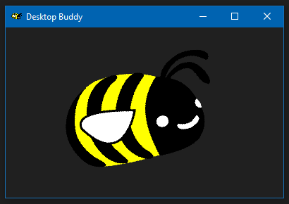
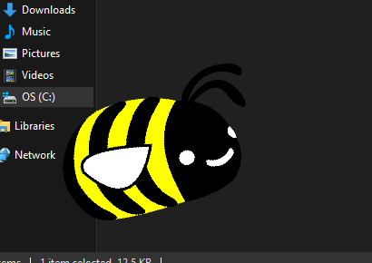

# Desktop Buddy (Windows Only)

 

Want a little dektop pet in the corner of your screen? 
This app lets you have your pet floating on anywhere on your screen. 

If you like this project, donations would be appreciated: &nbsp; [deriveitCreator](https://ko-fi.com/deriveitcreator)

### How to download:
- Download the zip from the releases.
- Extract the files and run `desktopBuddy.exe`.
- To use your own image, replace `image.png` with your own custom image.

### Hotkeys:
- `Esc`: close window.
- `b`: toggle window border.
- `f`: toggle float (the up and down movement).
- `t`: keep the window on top. You can click through the window when this is toggled on.
- `c`: Bring the window to the center of your monitor.
- `m`: toggle whether buddy looks at mouse.
- Arrow Keys: Move your buddy up, down, left or right.
- `w`/`a`/`s`/`d`: Change width and height.

### Screenshots:

<table><tbody><tr>
  <td></td>
  <td></td>
</tr></tbody></table>

Example image from <a href='https://commons.wikimedia.org/wiki/File:Bumblebee_white_eyes_clipart.svg'>wikimedia.org</a>.
