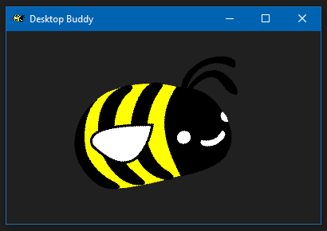
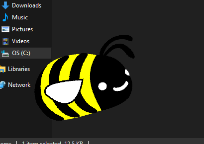

# Idle Floating Desktop Buddy (Windows Only)

 

Want a little dektop pet in the corner of your screen? 
This app lets you have your pet floating on a position of your liking. 

<u>Compilation:</u> `gcc main.c windows.c -o desktopBuddy.exe -lraylib -lgdi32 -lwinmm -Wl,--subsystem,windows`. 
Example image from <a href='https://commons.wikimedia.org/wiki/File:Bumblebee_white_eyes_clipart.svg'>wikimedia.org</a>.

### How to use:
- Run `idleFloatingDesktopBuddy.exe`.
- <u>To use your own image:</u>
  - Place the image in this folder, and rename it `image.png` (replacing the already provided one).
  - Then open `size.h` and set the dimensions of the image. Keep in mind that the window would be a square (where the length would be the size of the larger dimension of your image). 

### Hotkeys:
- `Esc`: close window.
- `b`: toggle window border.
- `f`: toggle float (the up and down movement).
- `t`: keep the window on top. You can click through the window when this is toggled on.

### Screenshots:

  
  

